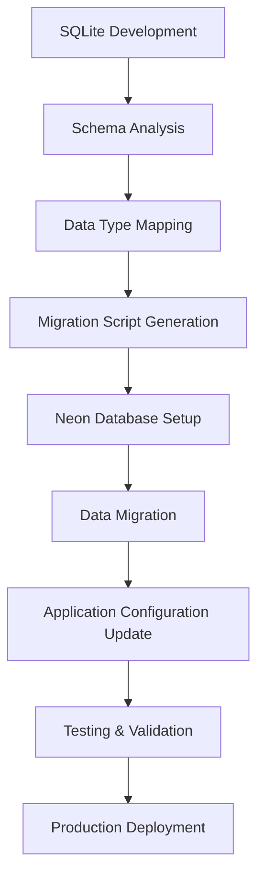

# Database Technology Decision Matrix

Comprehensive decision framework for choosing between Neon PostgreSQL, SQLite, and other database technologies based on project requirements, methodology, and constraints.

## Quick Decision Guide

### 🚀 MVP/Rapid Development (2-4 weeks)
**Recommended: SQLite → Neon PostgreSQL**
- **Development**: SQLite for rapid prototyping
- **Production**: Neon PostgreSQL for scalability
- **Migration**: Automated migration tools provided

### ⚖️ Balanced/Standard Development (4-8 weeks)
**Recommended: Neon PostgreSQL with SQLite for testing**
- **Development**: Neon PostgreSQL with branching
- **Testing**: SQLite in-memory for unit tests
- **Production**: Neon PostgreSQL with optimizations

### 🏢 Comprehensive/Enterprise Development (8-12 weeks)
**Recommended: Neon PostgreSQL with advanced features**
- **Development**: Neon PostgreSQL with full feature set
- **Testing**: Neon PostgreSQL test branches
- **Production**: Neon PostgreSQL with read replicas

## Detailed Decision Matrix

| Criteria | SQLite | Neon PostgreSQL | Traditional PostgreSQL | MySQL | MongoDB |
|----------|--------|-----------------|----------------------|-------|---------|
| **Setup Complexity** | ⭐⭐⭐⭐⭐ | ⭐⭐⭐⭐ | ⭐⭐ | ⭐⭐ | ⭐⭐⭐ |
| **Development Speed** | ⭐⭐⭐⭐⭐ | ⭐⭐⭐⭐ | ⭐⭐⭐ | ⭐⭐⭐ | ⭐⭐⭐⭐ |
| **Scalability** | ⭐⭐ | ⭐⭐⭐⭐⭐ | ⭐⭐⭐⭐⭐ | ⭐⭐⭐⭐ | ⭐⭐⭐⭐⭐ |
| **Concurrent Users** | ⭐⭐ | ⭐⭐⭐⭐⭐ | ⭐⭐⭐⭐⭐ | ⭐⭐⭐⭐ | ⭐⭐⭐⭐⭐ |
| **Data Integrity** | ⭐⭐⭐⭐ | ⭐⭐⭐⭐⭐ | ⭐⭐⭐⭐⭐ | ⭐⭐⭐⭐ | ⭐⭐⭐ |
| **Query Complexity** | ⭐⭐⭐ | ⭐⭐⭐⭐⭐ | ⭐⭐⭐⭐⭐ | ⭐⭐⭐⭐ | ⭐⭐⭐ |
| **Maintenance** | ⭐⭐⭐⭐⭐ | ⭐⭐⭐⭐⭐ | ⭐⭐ | ⭐⭐ | ⭐⭐⭐ |
| **Cost** | ⭐⭐⭐⭐⭐ | ⭐⭐⭐⭐ | ⭐⭐ | ⭐⭐⭐ | ⭐⭐⭐ |
| **Cloud Integration** | ⭐ | ⭐⭐⭐⭐⭐ | ⭐⭐⭐ | ⭐⭐⭐ | ⭐⭐⭐⭐ |
| **Backup/Recovery** | ⭐⭐ | ⭐⭐⭐⭐⭐ | ⭐⭐⭐⭐ | ⭐⭐⭐⭐ | ⭐⭐⭐⭐ |

## Use Case Scenarios

### 🎯 When to Choose SQLite

#### ✅ Perfect For:
```yaml
Project Types:
  - Prototypes and MVPs
  - Desktop applications
  - Mobile app backends (single user)
  - Development and testing environments
  - Embedded systems
  - Static site generators with dynamic features

Technical Requirements:
  - < 100 concurrent users
  - Simple to moderate queries
  - File-based storage acceptable
  - Minimal setup requirements
  - Single-server deployment

Team Constraints:
  - Small development team (1-3 developers)
  - Limited database administration experience
  - Tight timeline (< 4 weeks)
  - Budget constraints
```

#### ❌ Avoid SQLite When:
- High concurrent write operations (> 50 simultaneous)
- Multi-server deployment required
- Complex analytical queries needed
- Terabyte-scale data storage
- Real-time collaboration features
- Enterprise compliance requirements

### 🎯 When to Choose Neon PostgreSQL

#### ✅ Perfect For:
```yaml
Project Types:
  - Web applications with growth potential
  - SaaS platforms
  - E-commerce applications
  - Content management systems
  - API-first applications
  - Multi-tenant applications

Technical Requirements:
  - 100+ concurrent users
  - Complex queries and relationships
  - ACID compliance required
  - JSON/document storage needs
  - Full-text search capabilities
  - Horizontal scaling potential

Team Constraints:
  - Medium to large development teams
  - Cloud-first deployment strategy
  - Professional database management
  - 4+ week development timeline
  - Moderate to high budget
```

#### ❌ Avoid Neon When:
- Offline-first applications
- Extremely cost-sensitive projects
- Simple CRUD operations only
- Single-user applications
- Embedded system constraints

## Migration Pathways

### SQLite to Neon PostgreSQL Migration


#### Migration Checklist:
```yaml
Pre-Migration:
  - [ ] Analyze current SQLite schema
  - [ ] Identify data type conversions needed
  - [ ] Plan for JSON field migrations
  - [ ] Backup existing SQLite database
  - [ ] Set up Neon PostgreSQL instance

Migration Process:
  - [ ] Create PostgreSQL schema
  - [ ] Run data migration scripts
  - [ ] Update application configuration
  - [ ] Test all database operations
  - [ ] Verify data integrity

Post-Migration:
  - [ ] Update connection pooling
  - [ ] Optimize queries for PostgreSQL
  - [ ] Set up monitoring and alerts
  - [ ] Configure backup strategies
  - [ ] Update deployment scripts
```

## Framework-Specific Recommendations

### React Applications
```javascript
// Recommended database progression for React apps
const databaseStrategy = {
  development: {
    database: 'SQLite',
    rationale: 'Fast setup, no external dependencies',
    configuration: {
      filename: './data/development.sqlite',
      verbose: true
    }
  },
  
  testing: {
    database: 'SQLite (in-memory)',
    rationale: 'Fast test execution, isolated test runs',
    configuration: {
      filename: ':memory:',
      verbose: false
    }
  },
  
  production: {
    database: 'Neon PostgreSQL',
    rationale: 'Scalability, reliability, cloud integration',
    configuration: {
      connectionString: process.env.NEON_DATABASE_URL,
      ssl: { rejectUnauthorized: false },
      poolSize: 20
    }
  }
};
```

### Vue.js Applications
```javascript
// Vue.js database integration pattern
export default {
  development: {
    database: 'SQLite',
    orm: 'Prisma',
    features: ['hot-reload', 'query-logging']
  },
  
  production: {
    database: 'Neon PostgreSQL',
    orm: 'Prisma',
    features: ['connection-pooling', 'query-optimization', 'monitoring']
  }
};
```

### Angular Applications
```typescript
// Angular database service configuration
interface DatabaseConfig {
  type: 'sqlite' | 'postgresql';
  connection: string | object;
  features: string[];
}

const databaseConfigs: Record<string, DatabaseConfig> = {
  development: {
    type: 'sqlite',
    connection: './data/development.sqlite',
    features: ['verbose-logging', 'auto-migration']
  },
  
  production: {
    type: 'postgresql',
    connection: {
      host: process.env.NEON_HOST,
      database: process.env.NEON_DATABASE,
      ssl: true
    },
    features: ['connection-pooling', 'query-caching', 'monitoring']
  }
};
```

## Performance Considerations

### SQLite Performance Profile
```yaml
Strengths:
  - Extremely fast for read operations
  - Zero network latency
  - Efficient for small to medium datasets
  - Low memory footprint

Limitations:
  - Write operations are serialized
  - No concurrent write transactions
  - Limited to single server
  - File locking can cause bottlenecks

Optimization Tips:
  - Use WAL mode for better concurrency
  - Implement connection pooling
  - Optimize indexes for query patterns
  - Regular VACUUM operations
```

### Neon PostgreSQL Performance Profile
```yaml
Strengths:
  - Excellent concurrent performance
  - Advanced query optimization
  - Horizontal scaling capabilities
  - Rich indexing options

Considerations:
  - Network latency for queries
  - Connection pool management
  - Query optimization required
  - Resource monitoring needed

Optimization Tips:
  - Use connection pooling
  - Implement query caching
  - Monitor slow queries
  - Optimize indexes strategically
```

## Cost Analysis

### SQLite Total Cost of Ownership
```yaml
Development:
  - Setup Time: 1-2 hours
  - Learning Curve: Minimal
  - Maintenance: Very low

Production:
  - Hosting: Included with application
  - Backup: File-based (simple)
  - Monitoring: Basic application logs
  - Scaling: Vertical only

Total Monthly Cost: $0-50 (hosting only)
```

### Neon PostgreSQL Total Cost of Ownership
```yaml
Development:
  - Setup Time: 2-4 hours
  - Learning Curve: Moderate
  - Maintenance: Low (managed service)

Production:
  - Hosting: $20-200+ per month
  - Backup: Automated (included)
  - Monitoring: Advanced metrics included
  - Scaling: Horizontal and vertical

Total Monthly Cost: $20-500+ (depending on usage)
```

## Decision Framework

### Step 1: Assess Project Requirements
```yaml
Questions to Ask:
  - How many concurrent users expected?
  - What is the data growth projection?
  - Are complex queries required?
  - Is real-time collaboration needed?
  - What is the deployment timeline?
  - What is the available budget?
  - What is the team's database experience?
```

### Step 2: Apply Decision Rules
```javascript
function chooseDatabaseTechnology(requirements) {
  const {
    concurrentUsers,
    dataSize,
    queryComplexity,
    timeline,
    budget,
    teamExperience
  } = requirements;

  // Rule 1: MVP/Prototype projects
  if (timeline < 4 && budget < 1000) {
    return 'SQLite → Neon PostgreSQL migration path';
  }

  // Rule 2: High concurrency requirements
  if (concurrentUsers > 100) {
    return 'Neon PostgreSQL';
  }

  // Rule 3: Complex query requirements
  if (queryComplexity === 'high') {
    return 'Neon PostgreSQL';
  }

  // Rule 4: Simple applications
  if (concurrentUsers < 50 && queryComplexity === 'low') {
    return 'SQLite';
  }

  // Default recommendation
  return 'Neon PostgreSQL with SQLite for development';
}
```

### Step 3: Plan Migration Strategy
```yaml
Immediate Start:
  - SQLite for rapid development
  - Plan Neon PostgreSQL migration

Gradual Migration:
  - Start with Neon PostgreSQL
  - Use SQLite for testing

Enterprise Approach:
  - Neon PostgreSQL from day one
  - Advanced features and monitoring
```

## Related Documentation

### Core Database Documentation
- [Database Best Practices](./best-practices.md) - Implementation guidelines and optimization
- [SQLite Integration Guide](./sqlite-integration.md) - SQLite-specific patterns and configuration
- [Database Common Patterns](./common-patterns.md) - Reusable code patterns and schemas
- [Database Troubleshooting](./troubleshooting.md) - Issue resolution and diagnostics

### Authentication Integration
- [Authentication Patterns](../authentication/common-patterns.md) - User authentication with database integration
- [RBAC Patterns](../authentication/rbac-patterns.md) - Role-based access control database design

### Troubleshooting Integration
- [Active Blockers](../../../templates/troubleshooting/active-blockers/README.md) - Current database issues
- [Resolved Issues](../../../templates/troubleshooting/resolved-issues/README.md) - Historical solutions
- [Framework-Specific Troubleshooting](../../../templates/troubleshooting/framework-specific/README.md) - Technology-specific issues

### Project Lifecycle Integration
- [Technology Stack Selection](../../project-lifecycle/01-technology-stack-selection/README.md) - Database technology selection process
- [Core Development Phase](../../project-lifecycle/04-core-development/README.md) - Database implementation in development lifecycle

---

*Last Updated: 2025-07-11*
*Decision Framework Version: 1.0*
*Methodology Support: MVP/Balanced/Comprehensive*
*Integration: Authentication, Troubleshooting, Project Lifecycle*
